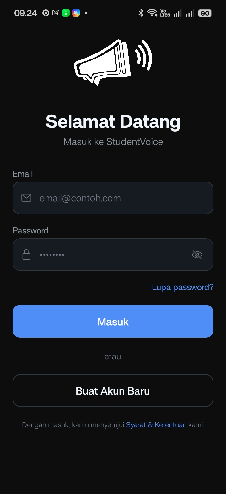
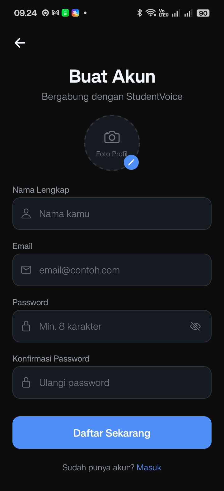
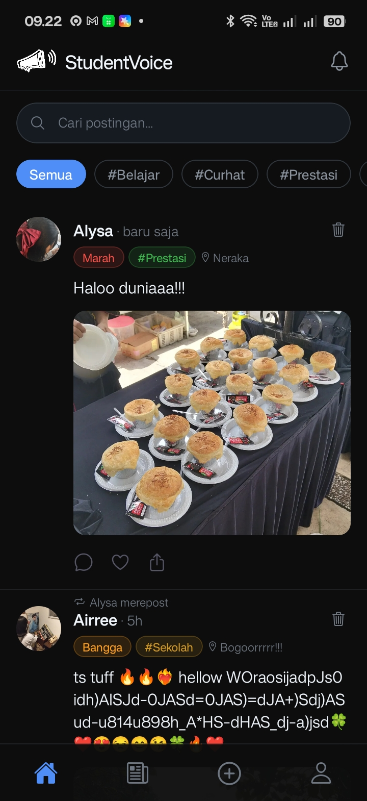
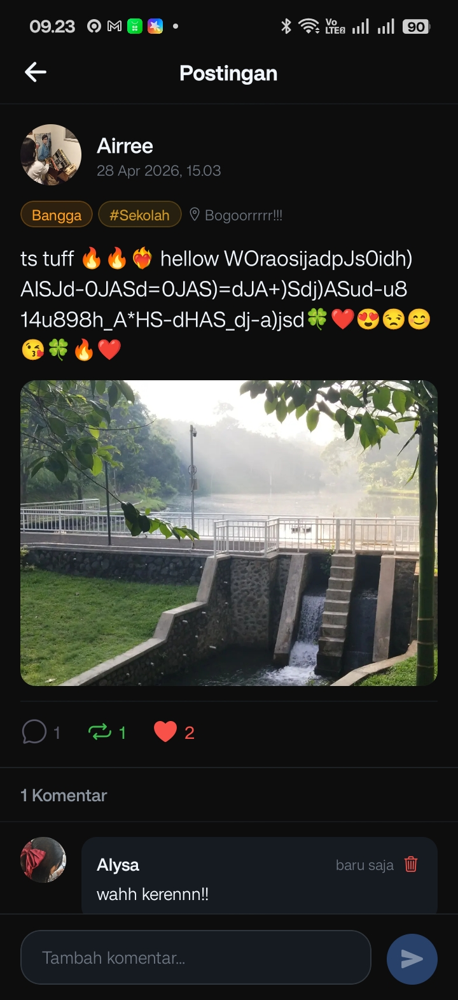
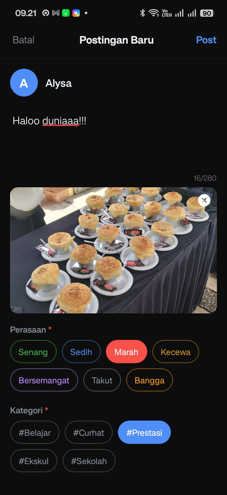
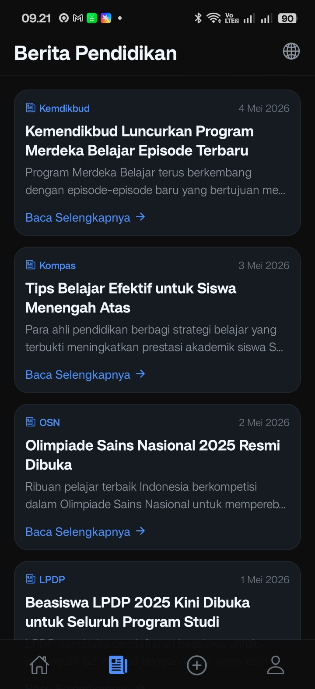
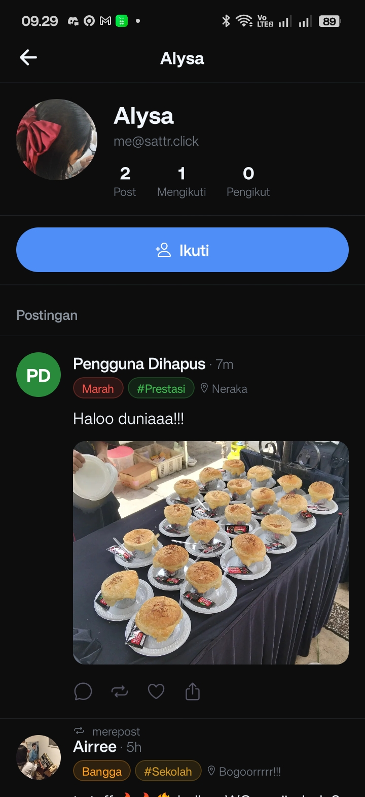
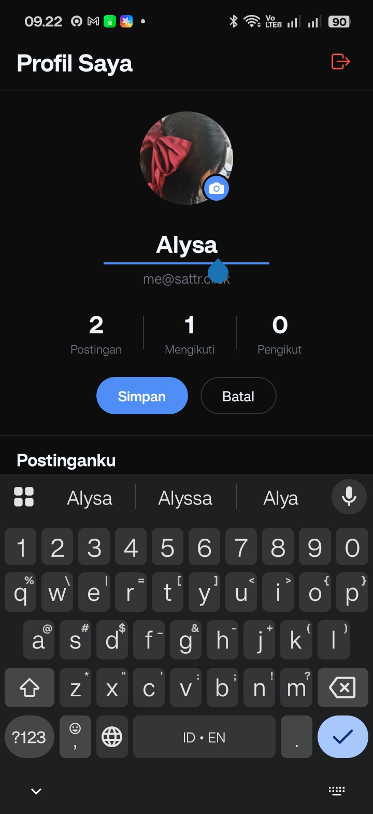

# StudentVoice 🎓

StudentVoice is a mobile application platform designed for students to share their voices, opinions, and news within their educational community. Built as a school assignment, this app provides a streamlined social experience for students to interact and stay informed.

## 🚀 Features

- **Authentication**: Secure login and registration system.
- **Dynamic Feed**: Browse posts and updates from the student community.
- **Post Management**: Create, edit, and delete posts with ease.
- **Interactions**: Engage with peers through comments on posts.
- **News Section**: Stay updated with the latest campus or school news.
- **User Profiles**: View and customize student profiles, and discover other members.

## 🛠️ Tech Stack

- **Framework**: [Expo](https://expo.dev/) (React Native)
- **Language**: [TypeScript](https://www.typescriptlang.org/)
- **Navigation**: [Expo Router](https://docs.expo.dev/router/introduction/) (File-based)
- **API Client**: [Axios](https://axios-http.com/)
- **Storage**: [AsyncStorage](https://react-native-async-storage.github.io/async-storage/)
- **UI Components**: [React Native Reanimated](https://docs.swmansion.com/react-native-reanimated/), [Expo Blur](https://docs.expo.dev/versions/latest/sdk/blur/), [Vector Icons](https://icons.expo.fyi/)

## 📸 Screenshots

| Login | Register | Homepage |
| :---: | :---: | :---: |
|  |  |  |
| **Post Detail** | **Add Post** | **Edit Post** |
|  |  |  |
| **News** | **My Profile** | **Other Profile** |
|  |  |  |
| **Profile Edit** | | |
|  | | |

## 🏁 Getting Started

### Prerequisites

- Node.js installed
- Expo Go app on your mobile device (or an emulator)

### Installation

1. Clone the repository
2. Install dependencies:
   ```bash
   npm install
   ```
3. Set your backend API URL in `services/api.ts`:
   ```typescript
   export const BASE_URL = 'http://your-ip-address:8000';
   ```

### Running the App

Start the development server:
```bash
npx expo start
```
Scan the QR code with Expo Go (Android) or the Camera app (iOS) to run the app on your device.
